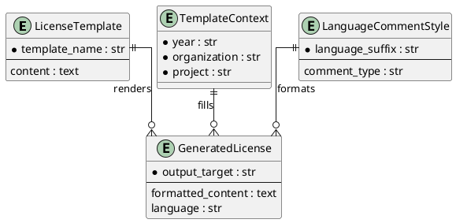

```plantuml
@startuml
skinparam linetype ortho
skinparam shadowing false

entity "LicenseTemplate" as LicenseTemplate {
  * template_name : str
  --
  content : text
}

entity "TemplateContext" as TemplateContext {
  * year : str
  * organization : str
  * project : str
}

entity "GeneratedLicense" as GeneratedLicense {
  * output_target : str
  --
  formatted_content : text
  language : str
}

entity "LanguageCommentStyle" as LanguageCommentStyle {
  * language_suffix : str
  --
  comment_type : str
}

TemplateContext ||--o{ GeneratedLicense : fills
LicenseTemplate ||--o{ GeneratedLicense : renders
LanguageCommentStyle ||--o{ GeneratedLicense : formats

@enduml
```