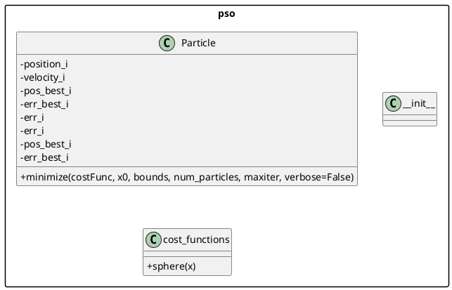

```plantuml
@startuml
skinparam classAttributeIconSize 0
skinparam packageStyle rectangle
skinparam shadowing false
package "pso" {
  class Particle {
    -position_i
    -velocity_i
    -pos_best_i
    -err_best_i
    -err_i
    -err_i
    -pos_best_i
    -err_best_i
    +minimize(costFunc, x0, bounds, num_particles, maxiter, verbose=False)
  }
  class __init__ {
  }
  class cost_functions {
    +sphere(x)
  }
}
@enduml
```
