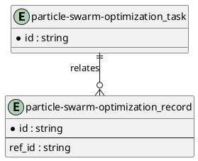

```plantuml
@startuml
' source_mode: source
skinparam linetype ortho
entity "particle-swarm-optimization_task" as A {
  * id : string
}
entity "particle-swarm-optimization_record" as B {
  * id : string
  --
  ref_id : string
}
A ||--o{ B : relates
@enduml
```
