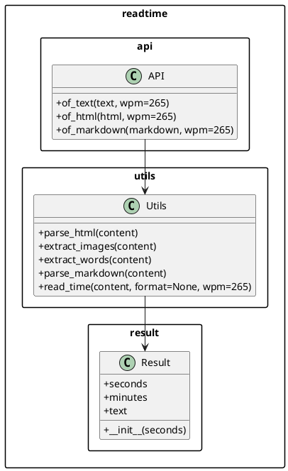

```plantuml
@startuml
skinparam classAttributeIconSize 0
skinparam shadowing false
skinparam packageStyle rectangle

package "readtime.api" {
  class API {
    +of_text(text, wpm=265)
    +of_html(html, wpm=265)
    +of_markdown(markdown, wpm=265)
  }
}

package "readtime.utils" {
  class Utils {
    +parse_html(content)
    +extract_images(content)
    +extract_words(content)
    +parse_markdown(content)
    +read_time(content, format=None, wpm=265)
  }
}

package "readtime.result" {
  class Result {
    +__init__(seconds)
    +seconds
    +minutes
    +text
  }
}

API --> Utils
Utils --> Result

@enduml
```