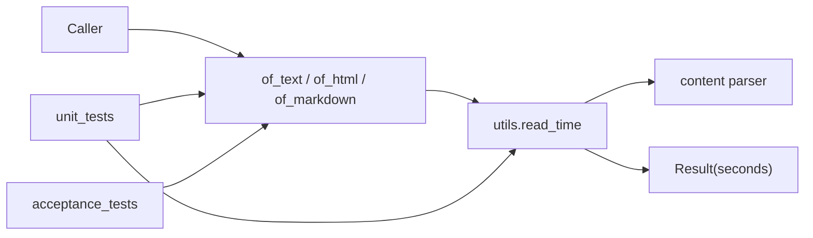

```mermaid
graph LR
    A["Caller"] --> B["of_text / of_html / of_markdown"]
    B --> C["utils.read_time"]
    C --> D["content parser"]
    C --> E["Result(seconds)"]
    F["unit_tests"] --> B
    F --> C
    G["acceptance_tests"] --> B
```