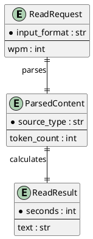

```plantuml
@startuml
skinparam linetype ortho
skinparam shadowing false

entity "ReadRequest" as ReadRequest {
  * input_format : str
  --
  wpm : int
}

entity "ReadResult" as ReadResult {
  * seconds : int
  --
  text : str
}

entity "ParsedContent" as ParsedContent {
  * source_type : str
  --
  token_count : int
}

ReadRequest ||--|| ParsedContent : parses
ParsedContent ||--|| ReadResult : calculates

@enduml
```