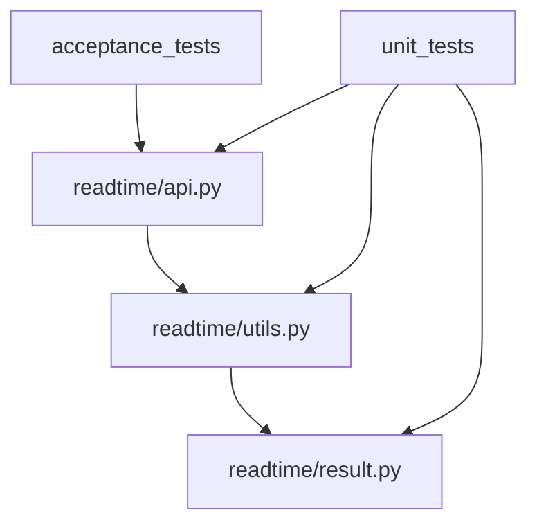

```mermaid
graph TD
    P1["readtime/api.py"]
    P2["readtime/utils.py"]
    P3["readtime/result.py"]
    P4["unit_tests"]
    P5["acceptance_tests"]

    P1 --> P2
    P2 --> P3
    P4 --> P1
    P4 --> P2
    P4 --> P3
    P5 --> P1
```