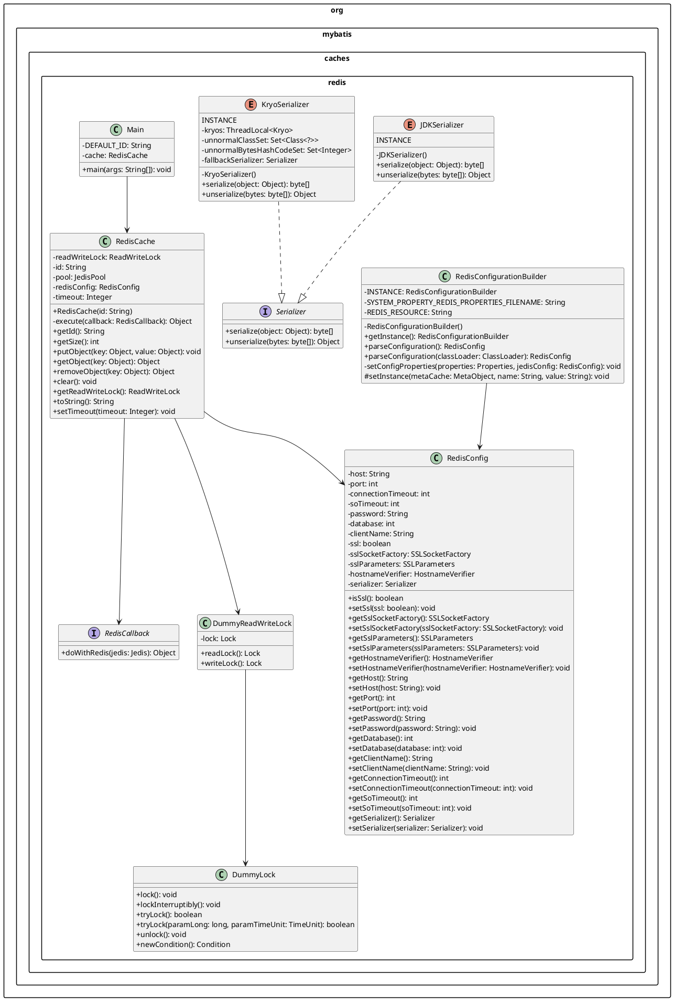

```plantuml
@startuml
skinparam classAttributeIconSize 0
skinparam shadowing false
skinparam packageStyle rectangle

package "org.mybatis.caches.redis" {

    interface Serializer {
      +serialize(object: Object): byte[]
      +unserialize(bytes: byte[]): Object
    }

    interface RedisCallback {
      +doWithRedis(jedis: Jedis): Object
    }

    class RedisConfig {
      -host: String
      -port: int
      -connectionTimeout: int
      -soTimeout: int
      -password: String
      -database: int
      -clientName: String
      -ssl: boolean
      -sslSocketFactory: SSLSocketFactory
      -sslParameters: SSLParameters
      -hostnameVerifier: HostnameVerifier
      -serializer: Serializer
      +isSsl(): boolean
      +setSsl(ssl: boolean): void
      +getSslSocketFactory(): SSLSocketFactory
      +setSslSocketFactory(sslSocketFactory: SSLSocketFactory): void
      +getSslParameters(): SSLParameters
      +setSslParameters(sslParameters: SSLParameters): void
      +getHostnameVerifier(): HostnameVerifier
      +setHostnameVerifier(hostnameVerifier: HostnameVerifier): void
      +getHost(): String
      +setHost(host: String): void
      +getPort(): int
      +setPort(port: int): void
      +getPassword(): String
      +setPassword(password: String): void
      +getDatabase(): int
      +setDatabase(database: int): void
      +getClientName(): String
      +setClientName(clientName: String): void
      +getConnectionTimeout(): int
      +setConnectionTimeout(connectionTimeout: int): void
      +getSoTimeout(): int
      +setSoTimeout(soTimeout: int): void
      +getSerializer(): Serializer
      +setSerializer(serializer: Serializer): void
    }

    class RedisConfigurationBuilder {
      -INSTANCE: RedisConfigurationBuilder
      -SYSTEM_PROPERTY_REDIS_PROPERTIES_FILENAME: String
      -REDIS_RESOURCE: String
      -RedisConfigurationBuilder()
      +getInstance(): RedisConfigurationBuilder
      +parseConfiguration(): RedisConfig
      +parseConfiguration(classLoader: ClassLoader): RedisConfig
      -setConfigProperties(properties: Properties, jedisConfig: RedisConfig): void
      #setInstance(metaCache: MetaObject, name: String, value: String): void
    }

    enum JDKSerializer {
      INSTANCE
      -JDKSerializer()
      +serialize(object: Object): byte[]
      +unserialize(bytes: byte[]): Object
    }

    enum KryoSerializer {
      INSTANCE
      -kryos: ThreadLocal<Kryo>
      -unnormalClassSet: Set<Class<?>>
      -unnormalBytesHashCodeSet: Set<Integer>
      -fallbackSerializer: Serializer
      -KryoSerializer()
      +serialize(object: Object): byte[]
      +unserialize(bytes: byte[]): Object
    }

    class RedisCache {
      -readWriteLock: ReadWriteLock
      -id: String
      -pool: JedisPool
      -redisConfig: RedisConfig
      -timeout: Integer
      +RedisCache(id: String)
      -execute(callback: RedisCallback): Object
      +getId(): String
      +getSize(): int
      +putObject(key: Object, value: Object): void
      +getObject(key: Object): Object
      +removeObject(key: Object): Object
      +clear(): void
      +getReadWriteLock(): ReadWriteLock
      +toString(): String
      +setTimeout(timeout: Integer): void
    }

    class DummyReadWriteLock {
      -lock: Lock
      +readLock(): Lock
      +writeLock(): Lock
    }

    class DummyLock {
      +lock(): void
      +lockInterruptibly(): void
      +tryLock(): boolean
      +tryLock(paramLong: long, paramTimeUnit: TimeUnit): boolean
      +unlock(): void
      +newCondition(): Condition
    }

    class Main {
      -DEFAULT_ID: String
      -cache: RedisCache
      +main(args: String[]): void
    }
}

JDKSerializer ..|> Serializer
KryoSerializer ..|> Serializer
RedisCache --> RedisConfig
RedisCache --> RedisCallback
RedisCache --> DummyReadWriteLock
DummyReadWriteLock --> DummyLock
RedisConfigurationBuilder --> RedisConfig
Main --> RedisCache

@enduml
```