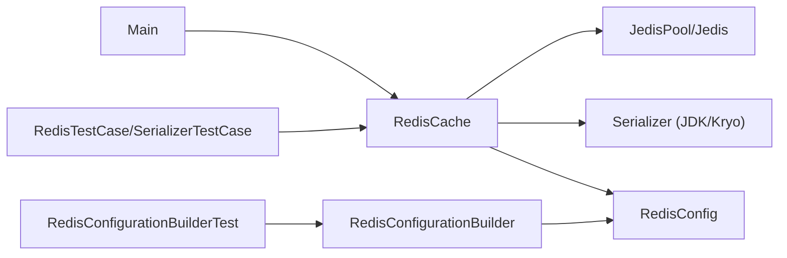

```mermaid
graph LR
    A["Main"] --> B["RedisCache"]
    B --> C["JedisPool/Jedis"]
    B --> D["Serializer (JDK/Kryo)"]
    B --> E["RedisConfig"]
    F["RedisConfigurationBuilder"] --> E
    G["RedisTestCase/SerializerTestCase"] --> B
    H["RedisConfigurationBuilderTest"] --> F
```