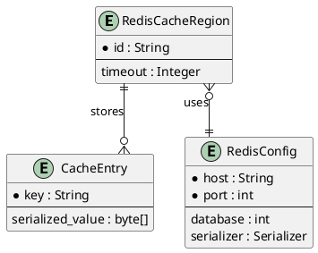

```plantuml
@startuml
skinparam linetype ortho
skinparam shadowing false

entity "RedisCacheRegion" as Region {
  * id : String
  --
  timeout : Integer
}

entity "CacheEntry" as Entry {
  * key : String
  --
  serialized_value : byte[]
}

entity "RedisConfig" as Config {
  * host : String
  * port : int
  --
  database : int
  serializer : Serializer
}

Region ||--o{ Entry : stores
Region }o--|| Config : uses

@enduml
```