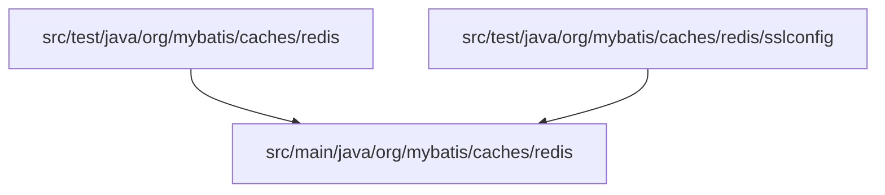

```mermaid
graph TD
    P1["src/main/java/org/mybatis/caches/redis"]
    P2["src/test/java/org/mybatis/caches/redis"]
    P3["src/test/java/org/mybatis/caches/redis/sslconfig"]

    P2 --> P1
    P3 --> P1
```