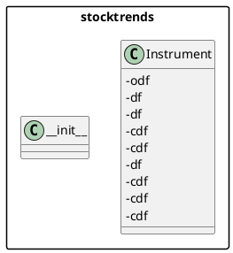

```plantuml
@startuml
skinparam classAttributeIconSize 0
skinparam packageStyle rectangle
skinparam shadowing false
package "stocktrends" {
  class Instrument {
    -odf
    -df
    -df
    -cdf
    -cdf
    -df
    -cdf
    -cdf
    -cdf
  }
  class __init__ {
  }
}
@enduml
```
