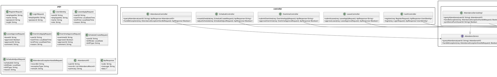

```plantuml
@startuml
skinparam classAttributeIconSize 0
skinparam packageStyle rectangle
skinparam shadowing false

package "controller" {
  class AuthController {
    +register(req: RegisterRequest): ApiResponse<UserIdentity>
    +login(req: LoginRequest): ApiResponse<UserIdentity>
  }

  class LeaveController {
    +submitLeave(req: LeaveApplyRequest): ApiResponse<String>
    +approveLeave(req: LeaveApproveRequest): ApiResponse<Boolean>
  }

  class OvertimeController {
    +submitOvertime(req: OvertimeApplyRequest): ApiResponse<String>
    +approveOvertime(req: OvertimeApproveRequest): ApiResponse<Boolean>
  }

  class ScheduleController {
    +createSchedule(req: ScheduleCreateRequest): ApiResponse<String>
    +adjustSchedule(req: ScheduleAdjustRequest): ApiResponse<Boolean>
  }

  class AttendanceController {
    +queryAttendance(userId: String): ApiResponse<AttendanceVO>
    +handleException(req: AttendanceExceptionHandleRequest): ApiResponse<Boolean>
  }
}

package "service" {
  interface AuthService {
    +register(req: RegisterRequest): UserIdentity
    +login(req: LoginRequest): UserIdentity
  }

  interface LeaveService {
    +submitLeave(req: LeaveApplyRequest): String
    +approveLeave(req: LeaveApproveRequest): Boolean
  }

  interface OvertimeService {
    +submitOvertime(req: OvertimeApplyRequest): String
    +approveOvertime(req: OvertimeApproveRequest): Boolean
  }

  interface ScheduleService {
    +createSchedule(req: ScheduleCreateRequest): String
    +adjustSchedule(req: ScheduleAdjustRequest): Boolean
  }

  interface AttendanceService {
    +queryAttendance(userId: String): AttendanceVO
    +handleException(req: AttendanceExceptionHandleRequest): Boolean
  }
}

package "service.impl" {
  class AuthServiceImpl {
    +register(req: RegisterRequest): UserIdentity
    +login(req: LoginRequest): UserIdentity
    -verifyIdentity(assertion: String): Boolean
  }

  class LeaveServiceImpl {
    +submitLeave(req: LeaveApplyRequest): String
    +approveLeave(req: LeaveApproveRequest): Boolean
    -checkLeaveBalance(userId: String, leaveHours: Integer): Boolean
  }

  class OvertimeServiceImpl {
    +submitOvertime(req: OvertimeApplyRequest): String
    +approveOvertime(req: OvertimeApproveRequest): Boolean
    -checkWorkingHourLimit(userId: String, overtimeHours: Integer): Boolean
  }

  class ScheduleServiceImpl {
    +createSchedule(req: ScheduleCreateRequest): String
    +adjustSchedule(req: ScheduleAdjustRequest): Boolean
    -detectConflict(req: ScheduleAdjustRequest): Boolean
  }

  class AttendanceServiceImpl {
    +queryAttendance(userId: String): AttendanceVO
    +handleException(req: AttendanceExceptionHandleRequest): Boolean
    -syncDevicePunch(userId: String): Boolean
  }
}

package "dao" {
  interface UserDao {
    +findByEmployeeNo(employeeNo: String): User
    +insert(user: User): Integer
  }

  interface LeaveRequestDao {
    +insert(req: LeaveRequest): Integer
    +findById(leaveId: String): LeaveRequest
    +updateStatus(leaveId: String, status: String): Integer
  }

  interface OvertimeRequestDao {
    +insert(req: OvertimeRequest): Integer
    +findById(overtimeId: String): OvertimeRequest
    +updateStatus(overtimeId: String, status: String): Integer
  }

  interface SchedulePlanDao {
    +insert(plan: SchedulePlan): Integer
    +update(plan: SchedulePlan): Integer
    +findByUserAndDate(userId: String, shiftDate: LocalDate): SchedulePlan
  }

  interface AttendanceRecordDao {
    +findByUserId(userId: String): List<AttendanceRecord>
    +insert(record: AttendanceRecord): Integer
    +updateException(recordId: String, exceptionType: String): Integer
  }

  interface ApprovalTaskDao {
    +insert(task: ApprovalTask): Integer
    +updateStatus(taskId: String, status: String): Integer
  }
}

package "entity" {
  class User {
    +userId: String
    +employeeNo: String
    +name: String
    +role: String
    +status: String
    +orgId: String
  }

  class LeaveRequest {
    +leaveId: String
    +userId: String
    +leaveType: String
    +startTime: LocalDateTime
    +endTime: LocalDateTime
    +status: String
  }

  class OvertimeRequest {
    +overtimeId: String
    +userId: String
    +startTime: LocalDateTime
    +endTime: LocalDateTime
    +status: String
  }

  class SchedulePlan {
    +scheduleId: String
    +userId: String
    +shiftDate: LocalDate
    +shiftType: String
    +status: String
  }

  class AttendanceRecord {
    +recordId: String
    +userId: String
    +punchTime: LocalDateTime
    +attendanceStatus: String
  }

  class ApprovalTask {
    +taskId: String
    +bizType: String
    +bizId: String
    +assigneeId: String
    +status: String
  }
}

package "pojo" {
  class RegisterRequest {
    +employeeNo: String
    +name: String
    +password: String
    +orgId: String
  }

  class LoginRequest {
    +employeeNo: String
    +password: String
  }

  class UserIdentity {
    +userId: String
    +employeeNo: String
    +name: String
    +role: String
  }

  class LeaveApplyRequest {
    +userId: String
    +startTime: LocalDateTime
    +endTime: LocalDateTime
    +reason: String
  }

  class LeaveApproveRequest {
    +leaveId: String
    +approved: Boolean
    +approverId: String
    +comment: String
  }

  class OvertimeApplyRequest {
    +userId: String
    +startTime: LocalDateTime
    +endTime: LocalDateTime
    +reason: String
  }

  class OvertimeApproveRequest {
    +overtimeId: String
    +approved: Boolean
    +approverId: String
    +comment: String
  }

  class ScheduleCreateRequest {
    +userId: String
    +shiftDate: LocalDate
    +shiftType: String
  }

  class ScheduleAdjustRequest {
    +scheduleId: String
    +shiftDate: LocalDate
    +shiftType: String
    +reason: String
  }

  class AttendanceExceptionHandleRequest {
    +recordId: String
    +exceptionType: String
    +remark: String
  }

  class AttendanceVO {
    +userId: String
    +records: List<AttendanceRecord>
    +summary: String
  }

  class ApiResponse<T> {
    +code: String
    +message: String
    +data: T
  }
}

AuthServiceImpl ..|> AuthService
LeaveServiceImpl ..|> LeaveService
OvertimeServiceImpl ..|> OvertimeService
ScheduleServiceImpl ..|> ScheduleService
AttendanceServiceImpl ..|> AttendanceService

AuthController --> AuthService
LeaveController --> LeaveService
OvertimeController --> OvertimeService
ScheduleController --> ScheduleService
AttendanceController --> AttendanceService

AuthServiceImpl --> UserDao
LeaveServiceImpl --> LeaveRequestDao
LeaveServiceImpl --> ApprovalTaskDao
OvertimeServiceImpl --> OvertimeRequestDao
OvertimeServiceImpl --> ApprovalTaskDao
ScheduleServiceImpl --> SchedulePlanDao
AttendanceServiceImpl --> AttendanceRecordDao

UserDao --> User
LeaveRequestDao --> LeaveRequest
OvertimeRequestDao --> OvertimeRequest
SchedulePlanDao --> SchedulePlan
AttendanceRecordDao --> AttendanceRecord
ApprovalTaskDao --> ApprovalTask

@enduml
```