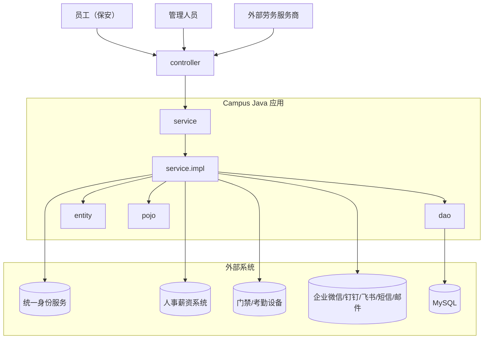

```mermaid
graph TB
    actor1["员工（保安）"] --> controller["controller"]
    actor2["管理人员"] --> controller
    actor3["外部劳务服务商"] --> controller

    subgraph app["Campus Java 应用"]
      service["service"]
      impl["service.impl"]
      dao["dao"]
      entity["entity"]
      pojo["pojo"]
    end

    subgraph ext["外部系统"]
      sso[("统一身份服务")]
      hr[("人事薪资系统")]
      device[("门禁/考勤设备")]
      notify[("企业微信/钉钉/飞书/短信/邮件")]
      db[("MySQL")]
    end

    controller --> service
    service --> impl
    impl --> dao
    impl --> entity
    impl --> pojo
    dao --> db

    impl --> sso
    impl --> hr
    impl --> device
    impl --> notify
```