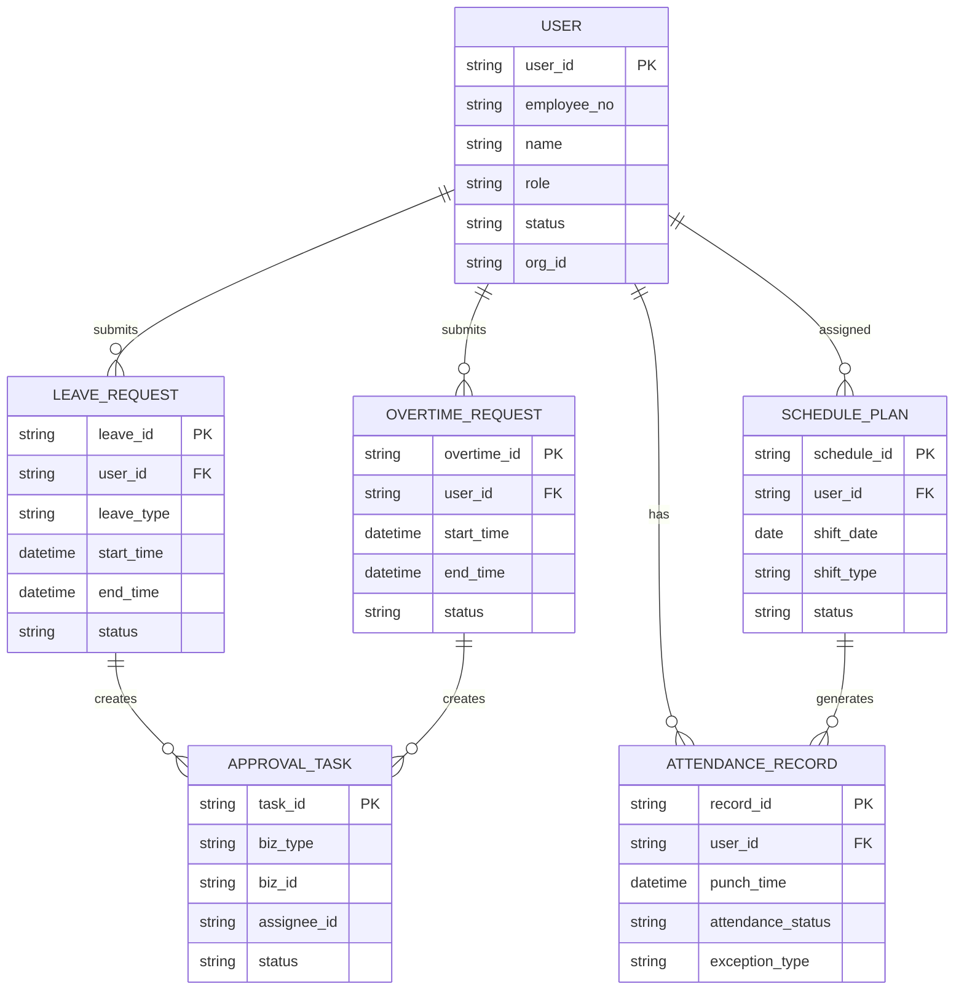

```mermaid
erDiagram
    USER ||--o{ LEAVE_REQUEST : submits
    USER ||--o{ OVERTIME_REQUEST : submits
    USER ||--o{ SCHEDULE_PLAN : assigned
    USER ||--o{ ATTENDANCE_RECORD : has

    LEAVE_REQUEST ||--o{ APPROVAL_TASK : creates
    OVERTIME_REQUEST ||--o{ APPROVAL_TASK : creates

    SCHEDULE_PLAN ||--o{ ATTENDANCE_RECORD : generates

    USER {
      string user_id PK
      string employee_no
      string name
      string role
      string status
      string org_id
    }

    LEAVE_REQUEST {
      string leave_id PK
      string user_id FK
      string leave_type
      datetime start_time
      datetime end_time
      string status
    }

    OVERTIME_REQUEST {
      string overtime_id PK
      string user_id FK
      datetime start_time
      datetime end_time
      string status
    }

    SCHEDULE_PLAN {
      string schedule_id PK
      string user_id FK
      date shift_date
      string shift_type
      string status
    }

    ATTENDANCE_RECORD {
      string record_id PK
      string user_id FK
      datetime punch_time
      string attendance_status
      string exception_type
    }

    APPROVAL_TASK {
      string task_id PK
      string biz_type
      string biz_id
      string assignee_id
      string status
    }
```