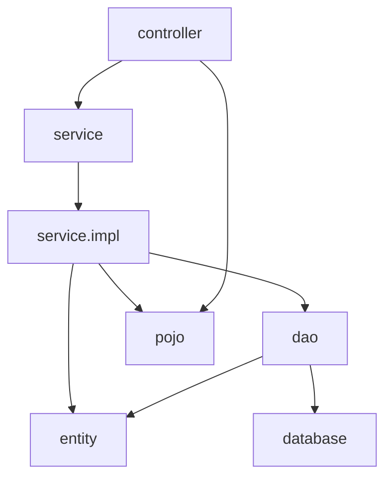

```mermaid
graph TD
    controller["controller"] --> service["service"]
    service --> serviceImpl["service.impl"]
    serviceImpl --> dao["dao"]
    serviceImpl --> entity["entity"]
    serviceImpl --> pojo["pojo"]
    dao --> entity
    dao --> db["database"]
    controller --> pojo
```