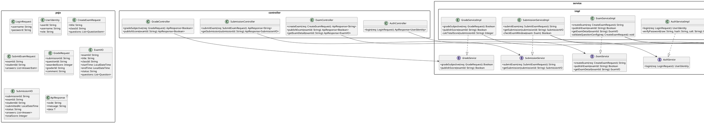

```plantuml
@startuml
skinparam classAttributeIconSize 0
skinparam packageStyle rectangle
skinparam shadowing false

package "controller" {
  class AuthController {
    +login(req: LoginRequest): ApiResponse<UserIdentity>
  }

  class ExamController {
    +createExam(req: CreateExamRequest): ApiResponse<String>
    +publishExam(examId: String): ApiResponse<Boolean>
    +getExamDetail(examId: String): ApiResponse<ExamVO>
  }

  class SubmissionController {
    +submitExam(req: SubmitExamRequest): ApiResponse<String>
    +getSubmission(submissionId: String): ApiResponse<SubmissionVO>
  }

  class GradeController {
    +gradeSubjective(req: GradeRequest): ApiResponse<Boolean>
    +publishScore(examId: String): ApiResponse<Boolean>
  }
}

package "service" {
  interface AuthService {
    +login(req: LoginRequest): UserIdentity
  }

  interface ExamService {
    +createExam(req: CreateExamRequest): String
    +publishExam(examId: String): Boolean
    +getExamDetail(examId: String): ExamVO
  }

  interface SubmissionService {
    +submitExam(req: SubmitExamRequest): String
    +getSubmission(submissionId: String): SubmissionVO
  }

  interface GradeService {
    +gradeSubjective(req: GradeRequest): Boolean
    +publishScore(examId: String): Boolean
  }
}

package "service.impl" {
  class AuthServiceImpl {
    +login(req: LoginRequest): UserIdentity
    -verifyPassword(raw: String, hash: String, salt: String): Boolean
  }

  class ExamServiceImpl {
    +createExam(req: CreateExamRequest): String
    +publishExam(examId: String): Boolean
    +getExamDetail(examId: String): ExamVO
    -validateQuestionConfig(req: CreateExamRequest): void
  }

  class SubmissionServiceImpl {
    +submitExam(req: SubmitExamRequest): String
    +getSubmission(submissionId: String): SubmissionVO
    -checkExamWindow(exam: Exam): Boolean
  }

  class GradeServiceImpl {
    +gradeSubjective(req: GradeRequest): Boolean
    +publishScore(examId: String): Boolean
    -calcTotalScore(submissionId: String): Integer
  }
}

package "dao" {
  interface UserDao {
    +findByUsername(username: String): User
  }

  interface ExamDao {
    +insert(exam: Exam): Integer
    +findById(examId: String): Exam
    +updateStatus(examId: String, status: String): Integer
  }

  interface QuestionDao {
    +insert(question: Question): Integer
    +findByExamId(examId: String): List<Question>
  }

  interface SubmissionDao {
    +insert(submission: Submission): Integer
    +findById(submissionId: String): Submission
  }

  interface AnswerDao {
    +insert(answer: Answer): Integer
    +findBySubmissionId(submissionId: String): List<Answer>
  }

  interface ScoreDao {
    +insert(score: Score): Integer
    +findBySubmissionId(submissionId: String): Score
  }
}

package "entity" {
  class User {
    +userId: String
    +username: String
    +passwordHash: String
    +passwordSalt: String
    +role: String
    +status: String
  }

  class ClassRoom {
    +classId: String
    +classCode: String
    +className: String
  }

  class Exam {
    +examId: String
    +title: String
    +classId: String
    +startTime: LocalDateTime
    +endTime: LocalDateTime
    +status: String
  }

  class Question {
    +questionId: String
    +examId: String
    +type: String
    +score: Integer
    +content: String
  }

  class Submission {
    +submissionId: String
    +examId: String
    +studentId: String
    +submittedAt: LocalDateTime
    +status: String
  }

  class Answer {
    +answerId: String
    +submissionId: String
    +questionId: String
    +studentAnswer: String
    +awardedScore: Integer
  }

  class Score {
    +scoreId: String
    +submissionId: String
    +totalScore: Integer
    +gradedAt: LocalDateTime
  }
}

package "pojo" {
  class LoginRequest {
    +username: String
    +password: String
  }

  class UserIdentity {
    +userId: String
    +username: String
    +role: String
  }

  class CreateExamRequest {
    +title: String
    +classId: String
    +questions: List<QuestionItem>
  }

  class SubmitExamRequest {
    +examId: String
    +studentId: String
    +answers: List<AnswerItem>
  }

  class GradeRequest {
    +submissionId: String
    +questionId: String
    +awardedScore: Integer
    +graderId: String
    +comment: String
  }

  class ExamVO {
    +examId: String
    +title: String
    +classId: String
    +startTime: LocalDateTime
    +endTime: LocalDateTime
    +status: String
    +questions: List<Question>
  }

  class SubmissionVO {
    +submissionId: String
    +examId: String
    +studentId: String
    +submittedAt: LocalDateTime
    +status: String
    +answers: List<Answer>
    +totalScore: Integer
  }

  class ApiResponse<T> {
    +code: String
    +message: String
    +data: T
  }
}

AuthServiceImpl ..|> AuthService
ExamServiceImpl ..|> ExamService
SubmissionServiceImpl ..|> SubmissionService
GradeServiceImpl ..|> GradeService

AuthController --> AuthService
ExamController --> ExamService
SubmissionController --> SubmissionService
GradeController --> GradeService

AuthServiceImpl --> UserDao
ExamServiceImpl --> ExamDao
ExamServiceImpl --> QuestionDao
SubmissionServiceImpl --> SubmissionDao
SubmissionServiceImpl --> AnswerDao
GradeServiceImpl --> ScoreDao

UserDao --> User
ExamDao --> Exam
QuestionDao --> Question
SubmissionDao --> Submission
AnswerDao --> Answer
ScoreDao --> Score

@enduml
```