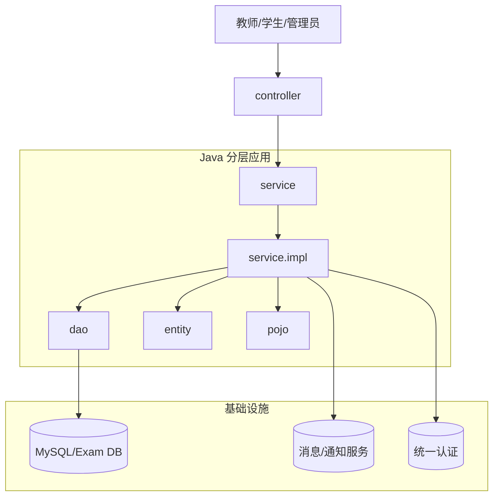

```mermaid
graph TB
    actor["教师/学生/管理员"] --> controller["controller"]

    subgraph app["Java 分层应用"]
      service["service"]
      impl["service.impl"]
      dao["dao"]
      entity["entity"]
      pojo["pojo"]
    end

    subgraph infra["基础设施"]
      db[("MySQL/Exam DB")]
      notify[("消息/通知服务")]
      sso[("统一认证")]
    end

    controller --> service
    service --> impl
    impl --> dao
    impl --> entity
    impl --> pojo
    dao --> db
    impl --> notify
    impl --> sso
```