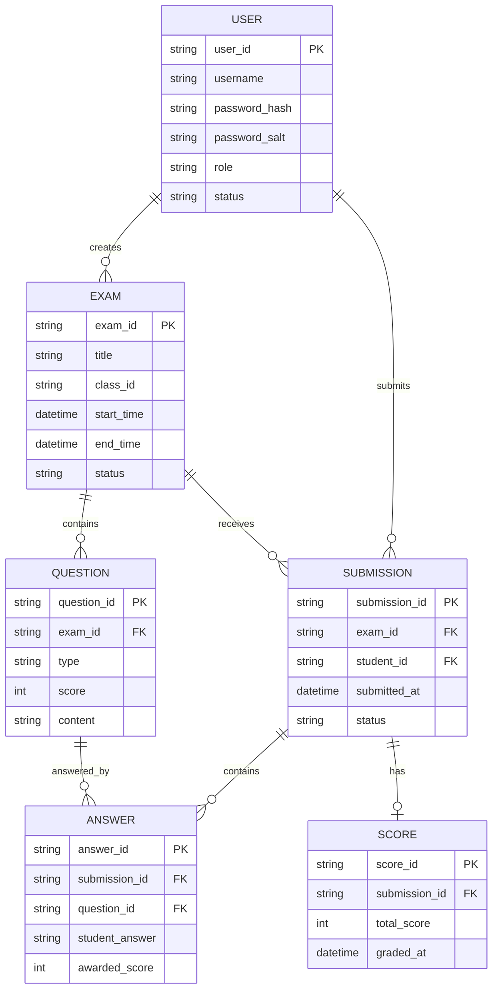

```mermaid
erDiagram
    USER ||--o{ EXAM : creates
    EXAM ||--o{ QUESTION : contains
    EXAM ||--o{ SUBMISSION : receives
    USER ||--o{ SUBMISSION : submits
    SUBMISSION ||--o{ ANSWER : contains
    QUESTION ||--o{ ANSWER : answered_by
    SUBMISSION ||--o| SCORE : has

    USER {
      string user_id PK
      string username
      string password_hash
      string password_salt
      string role
      string status
    }

    EXAM {
      string exam_id PK
      string title
      string class_id
      datetime start_time
      datetime end_time
      string status
    }

    QUESTION {
      string question_id PK
      string exam_id FK
      string type
      int score
      string content
    }

    SUBMISSION {
      string submission_id PK
      string exam_id FK
      string student_id FK
      datetime submitted_at
      string status
    }

    ANSWER {
      string answer_id PK
      string submission_id FK
      string question_id FK
      string student_answer
      int awarded_score
    }

    SCORE {
      string score_id PK
      string submission_id FK
      int total_score
      datetime graded_at
    }
```