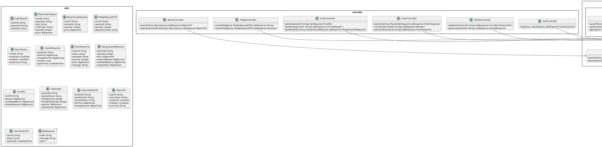

```plantuml
@startuml
skinparam classAttributeIconSize 0
skinparam packageStyle rectangle
skinparam shadowing false

package "controller" {
  class AuthController {
    +login(req: LoginRequest): ApiResponse<UserSessionVO>
  }

  class MarketController {
    +getWatchlist(userId: String): ApiResponse<List<WatchlistItemVO>>
    +getQuote(symbolId: String): ApiResponse<QuoteResponse>
  }

  class OrderController {
    +placeOrder(req: PlaceOrderRequest): ApiResponse<OrderResponse>
    +cancelOrder(orderId: String): ApiResponse<Boolean>
    +queryOrder(orderId: String): ApiResponse<OrderResponse>
  }

  class AssetController {
    +getFunds(userId: String): ApiResponse<FundVO>
    +getHoldings(userId: String): ApiResponse<List<HoldingVO>>
    +getMarginQuote(req: MarginQuoteRequest): ApiResponse<MarginQuoteResponse>
  }

  class ReportController {
    +queryPnl(req: ReportQuery): ApiResponse<ReportVO>
    +queryIndustryAllocation(req: ReportQuery): ApiResponse<ReportVO>
  }

  class PledgeController {
    +createPledge(req: PledgeRequestDTO): ApiResponse<String>
    +releasePledge(req: PledgeRequestDTO): ApiResponse<Boolean>
  }
}

package "service" {
  interface AuthService {
    +login(req: LoginRequest): UserSessionVO
  }

  interface MarketService {
    +getWatchlist(userId: String): List<WatchlistItemVO>
    +getQuote(symbolId: String): QuoteResponse
  }

  interface OrderService {
    +placeOrder(req: PlaceOrderRequest): OrderResponse
    +cancelOrder(orderId: String): Boolean
    +queryOrder(orderId: String): OrderResponse
  }

  interface AssetService {
    +getFunds(userId: String): FundVO
    +getHoldings(userId: String): List<HoldingVO>
    +getMarginQuote(req: MarginQuoteRequest): MarginQuoteResponse
  }

  interface ReportService {
    +queryPnl(req: ReportQuery): ReportVO
    +queryIndustryAllocation(req: ReportQuery): ReportVO
  }

  interface PledgeService {
    +createPledge(req: PledgeRequestDTO): String
    +releasePledge(req: PledgeRequestDTO): Boolean
  }
}

package "service.impl" {
  class AuthServiceImpl {
    +login(req: LoginRequest): UserSessionVO
    -verifyOtp(userId: String, otpCode: String): Boolean
  }

  class MarketServiceImpl {
    +getWatchlist(userId: String): List<WatchlistItemVO>
    +getQuote(symbolId: String): QuoteResponse
    -mergeRealtimeAndEod(symbolId: String): QuoteResponse
  }

  class OrderServiceImpl {
    +placeOrder(req: PlaceOrderRequest): OrderResponse
    +cancelOrder(orderId: String): Boolean
    +queryOrder(orderId: String): OrderResponse
    -preRiskCheck(req: PlaceOrderRequest): void
    -routeToExchange(order: Order): String
  }

  class AssetServiceImpl {
    +getFunds(userId: String): FundVO
    +getHoldings(userId: String): List<HoldingVO>
    +getMarginQuote(req: MarginQuoteRequest): MarginQuoteResponse
    -loadLatestMarginParam(symbolId: String): MarginParam
  }

  class ReportServiceImpl {
    +queryPnl(req: ReportQuery): ReportVO
    +queryIndustryAllocation(req: ReportQuery): ReportVO
    -aggregateTrades(req: ReportQuery): List<Trade>
  }

  class PledgeServiceImpl {
    +createPledge(req: PledgeRequestDTO): String
    +releasePledge(req: PledgeRequestDTO): Boolean
    -verifyDepositoryPermission(userId: String, depositoryCode: String): Boolean
  }
}

package "dao" {
  interface UserDao {
    +findByClientId(clientId: String): User
  }

  interface SessionDao {
    +insert(session: Session): Integer
    +updateStatus(sessionId: String, status: String): Integer
  }

  interface SymbolDao {
    +findById(symbolId: String): Symbol
    +findWatchlistSymbols(userId: String): List<Symbol>
  }

  interface OrderDao {
    +insert(order: Order): Integer
    +findById(orderId: String): Order
    +updateStatus(orderId: String, status: String): Integer
  }

  interface TradeDao {
    +insertBatch(trades: List<Trade>): Integer
    +findByOrderId(orderId: String): List<Trade>
  }

  interface FundAccountDao {
    +findByUserId(userId: String): FundAccount
    +updateBalance(account: FundAccount): Integer
  }

  interface HoldingDao {
    +findByUserId(userId: String): List<Holding>
    +findByUserSymbol(userId: String, symbolId: String): Holding
    +updateHolding(holding: Holding): Integer
  }

  interface MarginParamDao {
    +findLatestBySymbol(symbolId: String): MarginParam
  }

  interface PledgeRequestDao {
    +insert(req: PledgeRequest): Integer
    +updateStatus(pledgeId: String, status: String): Integer
  }
}

package "entity" {
  class User {
    +userId: String
    +clientId: String
    +name: String
    +status: String
    +riskLevel: String
    +createdAt: LocalDateTime
    +updatedAt: LocalDateTime
  }

  class Session {
    +sessionId: String
    +userId: String
    +token: String
    +otpVerified: Boolean
    +loginAt: LocalDateTime
    +expiredAt: LocalDateTime
    +status: String
  }

  class Symbol {
    +symbolId: String
    +symbolCode: String
    +name: String
    +exchange: String
    +industry: String
    +tickSize: BigDecimal
    +lotSize: Integer
    +status: String
  }

  class Order {
    +orderId: String
    +userId: String
    +symbolId: String
    +side: String
    +orderType: String
    +quantity: Integer
    +price: BigDecimal
    +filledQuantity: Integer
    +avgFillPrice: BigDecimal
    +status: String
    +exchangeOrderId: String
    +createdAt: LocalDateTime
    +updatedAt: LocalDateTime
  }

  class Trade {
    +tradeId: String
    +orderId: String
    +symbolId: String
    +quantity: Integer
    +price: BigDecimal
    +tradeTime: LocalDateTime
    +exchangeTradeId: String
  }

  class FundAccount {
    +accountId: String
    +userId: String
    +currency: String
    +balance: BigDecimal
    +availableBalance: BigDecimal
    +blockedAmount: BigDecimal
    +marginUsed: BigDecimal
    +updatedAt: LocalDateTime
  }

  class Holding {
    +holdingId: String
    +userId: String
    +symbolId: String
    +totalQuantity: Integer
    +availableQuantity: Integer
    +pledgedQuantity: Integer
    +avgCost: BigDecimal
    +marketValue: BigDecimal
    +updatedAt: LocalDateTime
  }

  class MarginParam {
    +marginParamId: String
    +symbolId: String
    +varPercent: BigDecimal
    +elmPercent: BigDecimal
    +additionalMarginPercent: BigDecimal
    +effectiveFrom: LocalDateTime
    +source: String
    +version: Integer
  }

  class PledgeRequest {
    +pledgeId: String
    +userId: String
    +symbolId: String
    +quantity: Integer
    +depositoryCode: String
    +status: String
    +requestedAt: LocalDateTime
    +approvedAt: LocalDateTime
    +remark: String
  }
}

package "pojo" {
  class LoginRequest {
    +clientId: String
    +password: String
    +otpCode: String
  }

  class PlaceOrderRequest {
    +userId: String
    +symbolId: String
    +side: String
    +orderType: String
    +quantity: Integer
    +price: BigDecimal
  }

  class MarginQuoteRequest {
    +userId: String
    +symbolId: String
    +quantity: Integer
    +price: BigDecimal
  }

  class PledgeRequestDTO {
    +userId: String
    +symbolId: String
    +quantity: Integer
    +depositoryCode: String
  }

  class ReportQuery {
    +userId: String
    +startDate: LocalDate
    +endDate: LocalDate
    +dimension: String
  }

  class QuoteResponse {
    +symbolId: String
    +lastPrice: BigDecimal
    +changePercent: BigDecimal
    +volume: Long
    +quoteTime: LocalDateTime
  }

  class OrderResponse {
    +orderId: String
    +status: String
    +symbolId: String
    +quantity: Integer
    +price: BigDecimal
    +message: String
  }

  class MarginQuoteResponse {
    +symbolId: String
    +quantity: Integer
    +price: BigDecimal
    +requiredMargin: BigDecimal
    +availableBalance: BigDecimal
    +marginRatio: BigDecimal
  }

  class FundVO {
    +userId: String
    +balance: BigDecimal
    +availableBalance: BigDecimal
    +blockedAmount: BigDecimal
  }

  class HoldingVO {
    +symbolId: String
    +symbolName: String
    +totalQuantity: Integer
    +availableQuantity: Integer
    +avgCost: BigDecimal
    +marketValue: BigDecimal
  }

  class WatchlistItemVO {
    +symbolId: String
    +symbolCode: String
    +symbolName: String
    +lastPrice: BigDecimal
    +changePercent: BigDecimal
  }

  class ReportVO {
    +userId: String
    +reportType: String
    +startDate: LocalDate
    +endDate: LocalDate
    +summary: String
  }

  class UserSessionVO {
    +userId: String
    +token: String
    +expiredAt: LocalDateTime
  }

  class ApiResponse<T> {
    +code: String
    +message: String
    +data: T
  }
}

AuthServiceImpl ..|> AuthService
MarketServiceImpl ..|> MarketService
OrderServiceImpl ..|> OrderService
AssetServiceImpl ..|> AssetService
ReportServiceImpl ..|> ReportService
PledgeServiceImpl ..|> PledgeService

AuthController --> AuthService
MarketController --> MarketService
OrderController --> OrderService
AssetController --> AssetService
ReportController --> ReportService
PledgeController --> PledgeService

AuthServiceImpl --> UserDao
AuthServiceImpl --> SessionDao
MarketServiceImpl --> SymbolDao
OrderServiceImpl --> OrderDao
OrderServiceImpl --> TradeDao
OrderServiceImpl --> MarginParamDao
OrderServiceImpl --> FundAccountDao
AssetServiceImpl --> FundAccountDao
AssetServiceImpl --> HoldingDao
AssetServiceImpl --> MarginParamDao
PledgeServiceImpl --> PledgeRequestDao
PledgeServiceImpl --> HoldingDao

UserDao --> User
SessionDao --> Session
SymbolDao --> Symbol
OrderDao --> Order
TradeDao --> Trade
FundAccountDao --> FundAccount
HoldingDao --> Holding
MarginParamDao --> MarginParam
PledgeRequestDao --> PledgeRequest

@enduml
```