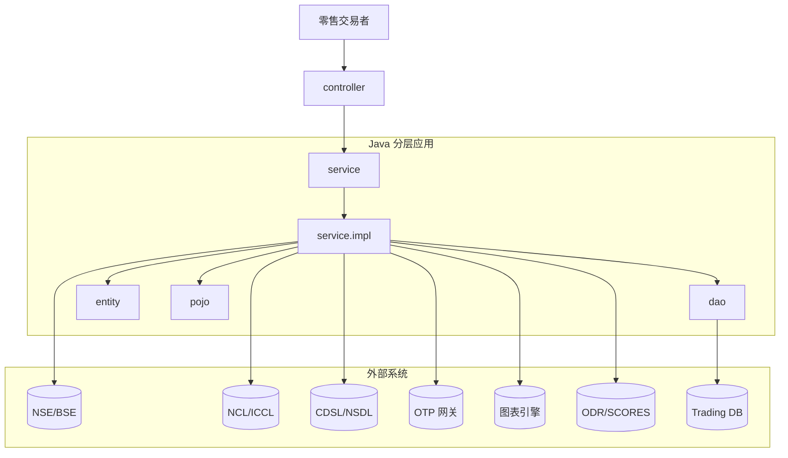

```mermaid
graph TB
    user["零售交易者"] --> controller["controller"]

    subgraph app["Java 分层应用"]
      service["service"]
      impl["service.impl"]
      dao["dao"]
      entity["entity"]
      pojo["pojo"]
    end

    subgraph external["外部系统"]
      ex[("NSE/BSE")]
      cc[("NCL/ICCL")]
      dep[("CDSL/NSDL")]
      otp[("OTP 网关")]
      chart[("图表引擎")]
      odr[("ODR/SCORES")]
      db[("Trading DB")]
    end

    controller --> service
    service --> impl
    impl --> dao
    impl --> entity
    impl --> pojo

    dao --> db
    impl --> ex
    impl --> cc
    impl --> dep
    impl --> otp
    impl --> chart
    impl --> odr
```