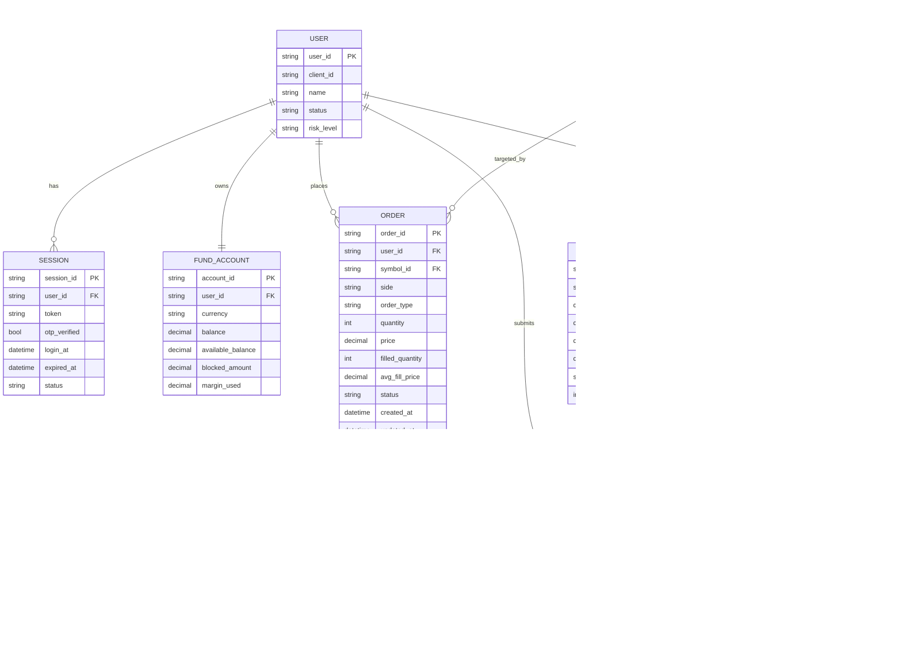

```mermaid
erDiagram
    USER ||--o{ SESSION : has
    USER ||--|| FUND_ACCOUNT : owns
    USER ||--o{ ORDER : places
    USER ||--o{ HOLDING : holds
    USER ||--o{ PLEDGE_REQUEST : submits

    SYMBOL ||--o{ ORDER : targeted_by
    SYMBOL ||--o{ HOLDING : represented_by
    SYMBOL ||--o{ MARGIN_PARAM : applies_to

    ORDER ||--o{ TRADE : fills

    HOLDING ||--o{ PLEDGE_REQUEST : pledged_from

    USER {
      string user_id PK
      string client_id
      string name
      string status
      string risk_level
    }

    SESSION {
      string session_id PK
      string user_id FK
      string token
      bool otp_verified
      datetime login_at
      datetime expired_at
      string status
    }

    SYMBOL {
      string symbol_id PK
      string symbol_code
      string name
      string exchange
      string industry
      decimal tick_size
      int lot_size
      string status
    }

    ORDER {
      string order_id PK
      string user_id FK
      string symbol_id FK
      string side
      string order_type
      int quantity
      decimal price
      int filled_quantity
      decimal avg_fill_price
      string status
      datetime created_at
      datetime updated_at
    }

    TRADE {
      string trade_id PK
      string order_id FK
      string symbol_id FK
      int quantity
      decimal price
      datetime trade_time
    }

    FUND_ACCOUNT {
      string account_id PK
      string user_id FK
      string currency
      decimal balance
      decimal available_balance
      decimal blocked_amount
      decimal margin_used
    }

    HOLDING {
      string holding_id PK
      string user_id FK
      string symbol_id FK
      int total_quantity
      int available_quantity
      int pledged_quantity
      decimal avg_cost
      decimal market_value
    }

    MARGIN_PARAM {
      string margin_param_id PK
      string symbol_id FK
      decimal var_percent
      decimal elm_percent
      decimal additional_margin_percent
      datetime effective_from
      string source
      int version
    }

    PLEDGE_REQUEST {
      string pledge_id PK
      string user_id FK
      string symbol_id FK
      int quantity
      string depository_code
      string status
      datetime requested_at
      datetime approved_at
      string remark
    }
```