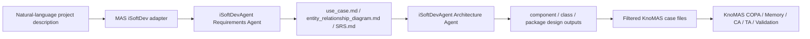

# iSoftDevAgent to KnoMAS Integration

## Goal

MAS now supports creating a KnoMAS case from a natural-language project description.

The pipeline is:



## Runtime Entry

Frontend:

- `Dataset Management -> KnoMAS -> Generate From Input`
- The dialog accepts `dataset`, `case_name`, `project_name`, and a natural-language requirement description.
- By default it enables iSoftDevAgent execution.

Backend API:

```text
POST /api/datasets/knomas/cases/from-input
```

Main implementation:

```text
backend/app/isoftdev_adapter.py
```

## Called iSoftDevAgent Agents

### Requirements Agent

Root:

```text
D:\projects\iSoftDevAgent\Requirements Agent\reagent
```

Command shape:

```bash
python src/reagent/main.py \
  --project_name "<project_name>" \
  --description_file "<archived_input_file>" \
  --srs_example_path "util/doc_template/document_example.md"
```

Important outputs:

- `use_case.md`
- `entity_relationship_diagram.md`
- `SRS.md`

### Architecture Agent

Root:

```text
D:\projects\iSoftDevAgent\Architecture Agent
```

Command shape:

```bash
python src/arch_agent/main.py "<Requirements Agent SRS.md>" "<project_name>"
```

Important outputs:

- `component_design.json`
- `class_design_raw.md`
- `class_design_structured.json`
- `modeling-3.static_design_output.txt`
- `modeling-1.tech_stack_selection_output.txt`

## KnoMAS File Mapping

| KnoMAS file | Preferred source | Filtering |
|---|---|---|
| `use_case.md` | Requirements Agent `use_case.md` | copied directly |
| `entity_relationship_diagram.md` | Requirements Agent `entity_relationship_diagram.md` | keep the Mermaid block when present |
| `component_diagram.md` | Architecture Agent `component_design.json.component_diagram` | wrap as PlantUML or Mermaid fenced block |
| `class_diagram.md` | Architecture Agent `class_design_raw.md` | copied directly |
| `package_diagram.md` | Architecture Agent `modeling-3.static_design_output.txt` | extract `UML Package Diagram` PlantUML block |
| `tech_stack.json` | Architecture Agent tech/static design text | normalized to KnoMAS `backend/frontend` format |
| `input_source.md` | MAS archived user input | copied directly |
| `isoftdev_generation_report.md` | MAS adapter | source mapping plus agent logs |

If iSoftDevAgent fails or is disabled, MAS still writes fallback KnoMAS files so the case is editable, but the generation report records that fallback was used.

## Environment Variables

These variables can be set in `backend/.env`:

```bash
ISOFTDEV_ROOT=D:/projects/iSoftDevAgent
ISOFTDEV_PYTHON=python
ISOFTDEV_REQUIREMENTS_PYTHON=python
ISOFTDEV_ARCHITECTURE_PYTHON=python
ISOFTDEV_TIMEOUT_SEC=1800
```

`ISOFTDEV_REQUIREMENTS_PYTHON` and `ISOFTDEV_ARCHITECTURE_PYTHON` are optional. If omitted, MAS falls back to `ISOFTDEV_PYTHON`, then to `python`.

## Changes Made in MAS

- Reworked `backend/app/isoftdev_adapter.py` from a fallback generator into a two-agent orchestrator.
- Added extraction rules for Requirements Agent and Architecture Agent outputs.
- Preserved provenance in `isoftdev_generation_report.md`.
- Updated the dataset management dialog so the input-generation path calls both iSoftDevAgent agents by default.

No iSoftDevAgent source files are modified by this integration.
